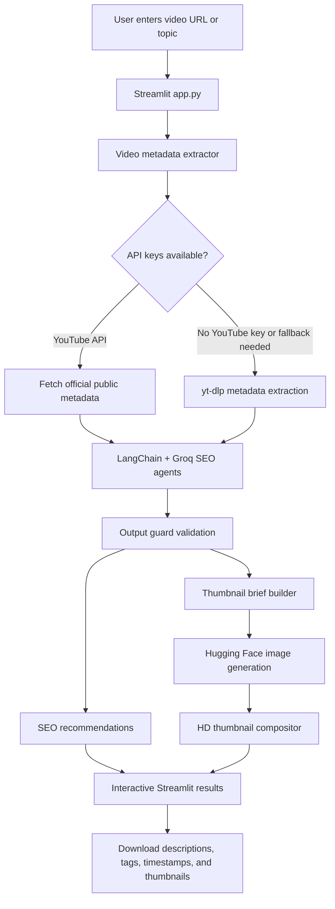
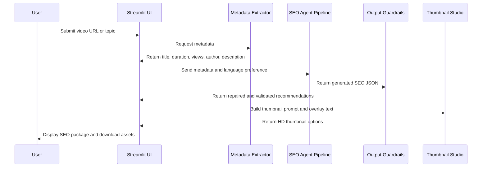

<div align="center">

  

  # Multi-Model AI Video SEO Optimizer and Thumbnail Studio

  <p>
    <strong>BS Computer Science Final Year Project</strong><br/>
    An AI-powered Streamlit application for video SEO analysis, metadata optimization, and HD thumbnail generation.
  </p>

  

  <br/><br/>

  
  
  
  
  

</div>

---

## Overview

**Multi-Model AI Video SEO Optimizer and Thumbnail Studio** is a Project built for creators, marketers, and students who want to improve the discoverability of online videos. The system accepts a video URL, extracts available metadata, analyzes the content context, and generates SEO-friendly recommendations such as tags, titles, descriptions, timestamps, and thumbnail concepts.

The project combines a Streamlit user interface with AI-assisted SEO generation, platform metadata extraction, structured output validation, and optional AI image generation for 1280 x 720 thumbnail assets.

---

## Core Features

| Feature | What It Does | Main Files |
| --- | --- | --- |
| Video metadata extraction | Extracts title, description, duration, views, channel name, thumbnail URL, and platform information. Uses YouTube Data API when available and `yt-dlp` fallback when needed. | `utils/video_extractor.py` |
| Multi-agent SEO generation | Uses LangChain and Groq to generate SEO recommendations from video metadata and content context. | `utils/seo_agents.py` |
| SEO scoring and analysis | Evaluates keywords, descriptions, tags, titles, and optimization quality. | `analysis_functions.py` |
| Output guardrails | Repairs and validates model responses so the UI receives clean structured data. | `utils/output_guard.py` |
| Thumbnail Studio | Builds thumbnail briefs, generates AI images through Hugging Face, overlays text, and exports images. | `utils/thumbnails.py` |
| Streamlit interface | Provides the complete interactive dashboard, sidebar API configuration, analysis results, and download buttons. | `app.py` |

---

## System Architecture



---

## AI Workflow



---

## Repository Structure

```text
video-seo-optimizer/
|-- app.py
|-- analysis_functions.py
|-- requirements.txt
|-- README.md
|-- .env.example
|-- .gitignore
|-- assets/
|   `-- logo.png
`-- utils/
    |-- __init__.py
    |-- output_guard.py
    |-- seo_agents.py
    |-- thumbnails.py
    `-- video_extractor.py
```

This GitHub-ready folder intentionally excludes:

- `.env` real secrets
- `.venv` virtual environment
- `.git` local repository history
- `.agents` workspace files
- `.streamlit` runtime files
- `__pycache__` Python cache
- zip archives and generated output files

---

## Technology Stack

| Layer | Tools and Libraries |
| --- | --- |
| Frontend | Streamlit |
| AI orchestration | LangChain |
| LLM provider | Groq API |
| Optional OpenAI fallback module | OpenAI Python SDK |
| Thumbnail generation | Hugging Face Inference API, Pillow |
| Metadata extraction | YouTube Data API v3, yt-dlp, requests |
| Data handling | pandas, numpy, pydantic |
| Environment management | python-dotenv |

---

## Installation

### 1. Clone the repository

```bash
git clone https://github.com/your-username/video-seo-optimizer.git
cd video-seo-optimizer
```

### 2. Create a virtual environment

Windows PowerShell:

```powershell
python -m venv .venv
.\.venv\Scripts\Activate.ps1
```

Linux or macOS:

```bash
python3 -m venv .venv
source .venv/bin/activate
```

### 3. Install dependencies

```bash
pip install -r requirements.txt
```

### 4. Configure environment variables

Create a local `.env` file from the example file.

Windows PowerShell:

```powershell
Copy-Item .env.example .env
```

Linux or macOS:

```bash
cp .env.example .env
```

Then add your own API keys:

```env
GROQ_API_KEY=your_groq_api_key_here
HF_TOKEN=your_hugging_face_token_here
YOUTUBE_API_KEY=your_youtube_data_api_key_here
```

### 5. Run the application

```bash
streamlit run app.py
```

Open the local app in your browser:

```text
http://localhost:8501
```

---

## API Keys

| Key | Required | Purpose |
| --- | --- | --- |
| `GROQ_API_KEY` | Recommended | Powers the main LangChain SEO agent workflow. |
| `HF_TOKEN` | Required for AI thumbnails | Generates HD thumbnail artwork through Hugging Face. |
| `YOUTUBE_API_KEY` | Optional | Improves metadata accuracy using the official YouTube Data API. |
| `OPENAI_API_KEY` | Optional | Used only by the optional `analysis_functions.py` OpenAI path. |

Never commit the real `.env` file to GitHub. This repository includes `.env.example` only.

---

## How to Use

1. Start the Streamlit app.
2. Enter a YouTube video URL or supported video topic.
3. Add API keys in the sidebar or in your local `.env` file.
4. Run the SEO analysis.
5. Review generated titles, tags, descriptions, timestamps, and SEO insights.
6. Generate thumbnail concepts and HD thumbnail images if a Hugging Face token is configured.
7. Download individual thumbnails or export all generated thumbnail options as a zip file.

---

## Output Examples

The app can generate:

- Search-optimized titles
- 35 relevant tags or hashtags
- Long-form SEO descriptions
- Video chapter timestamps
- SEO score and improvement suggestions
- Thumbnail concepts with color direction, focal point, tone, and composition
- 1280 x 720 thumbnail images with overlay text

---

## Academic Relevance

This project demonstrates practical implementation of several Computer Science concepts:

- Natural Language Processing
- Prompt engineering
- Agentic AI workflow design
- API integration
- Web application development
- Data validation and repair
- Multimedia metadata extraction
- Generative AI image processing
- Human-computer interaction through Streamlit

---

## Final Year Project Details

| Field | Detail |
| --- | --- |
| Degree | BS Computer Science |
| Project Type | Final Year Project |
| Domain | Artificial Intelligence, SEO Automation, Web Development |
| Application Type | AI-powered Streamlit web app |
| Main Objective | Automate video SEO recommendations and thumbnail generation |

---

## GitHub Upload Checklist

Before uploading, confirm that your repository contains only these useful files:

- `app.py`
- `analysis_functions.py`
- `requirements.txt`
- `README.md`
- `.env.example`
- `.gitignore`
- `assets/logo.png`
- `utils/*.py`

Do not upload:

- `.env`
- `.venv/`
- `__pycache__/`
- `.git/`
- zip files
- generated thumbnails containing private/client data
- local logs or temporary files

---

## Useful Git Commands

Run these commands from inside the `video-seo-optimizer` folder:

```bash
git init
git add .
git commit -m "Initial commit: AI video SEO optimizer"
git branch -M main
git remote add origin https://github.com/your-username/video-seo-optimizer.git
git push -u origin main
```

---

## Future Enhancements

- Add user authentication for saved SEO projects
- Add database storage for analysis history
- Add support for TikTok, Instagram Reels, and Facebook videos
- Add competitor keyword comparison
- Add automated PDF export for SEO reports
- Add thumbnail A/B testing score prediction
- Deploy on Streamlit Community Cloud or Hugging Face Spaces

---

<div align="center">

  

  <strong>Built as a BS Computer Science Final Year Project</strong>

</div>
